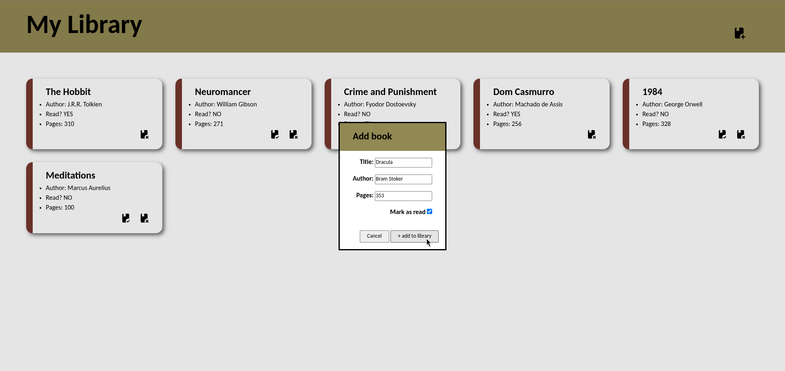

# Project: Library

> A simple study project with arrays and objects.

## 🚀 Live Preview

**[Clique aqui para testar o projeto](https://elvismourab.github.io/library-project/)**

## 📖 Description

This project is part of the curriculum for [The Odin Project](https://www.theodinproject.com) - <i>JavaScript Course</i>.

[Project: Library ](https://www.theodinproject.com/lessons/node-path-javascript-library)

## 🛠️ Tech Stack
- HTML
- CSS
- JS

## 🧠 What have I learned

- create objects from a constructor;
- use window.confirm;
- find an element in an array using .findIndex;
- remove an element from an array using .splice;
- vanilla modal manipulation + dialog;

## 💻 How to Run Locally

1. Clone the repository.
2. Enter the directory.
3. Open `index.html` in your browser.
